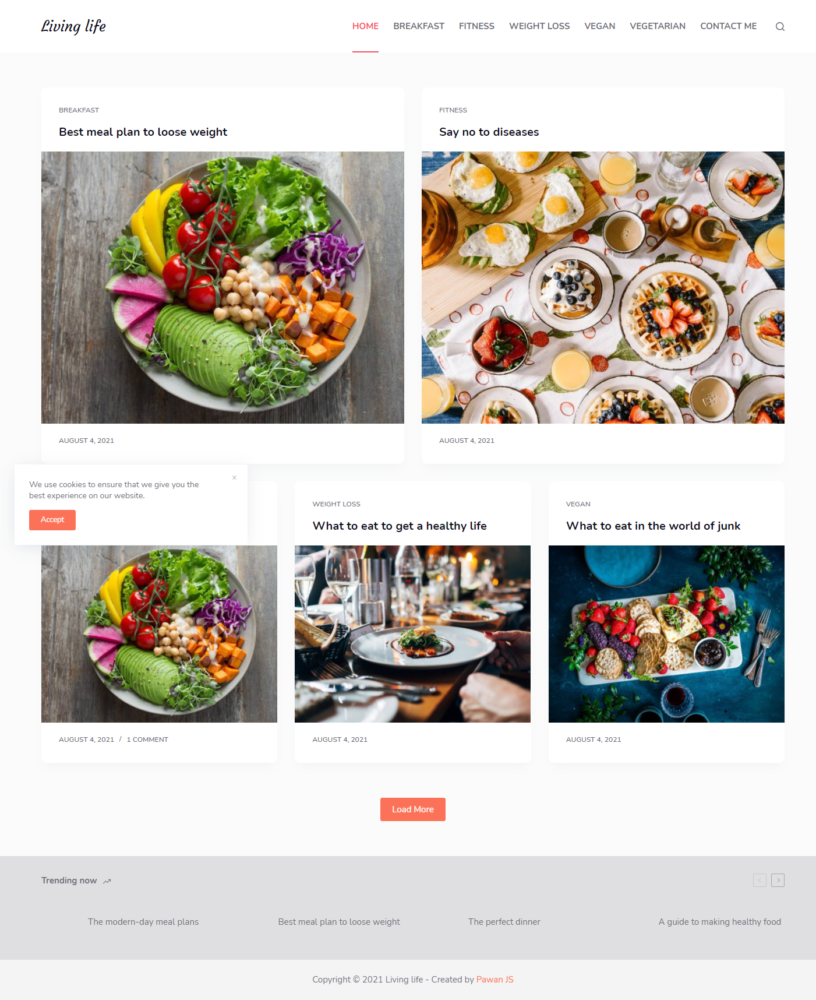

# No code websites

Here are the list of websites I made with no code tools like shopify and wordpress. I am a front-end developer who mainly uses HTML, CSS, JavaScript and React but for sometime I just need a break and want to try some nocode tools like wordpress and shopify.

**The first website** I developed using shopify is a simple furniture store. You can have a look at the store here [Furnish](https://furnish-by-pawanjs.myshopify.com/).

The password for the store is 123456. You can have a look at the store.

**The second** website I developed using wordpress the most popular CMS. I used wordpress for the first time and found it more customizable than shopify. You can have a look at the store here [Living Life](https://www.blog-by-pawanjs.epizy.com/).

